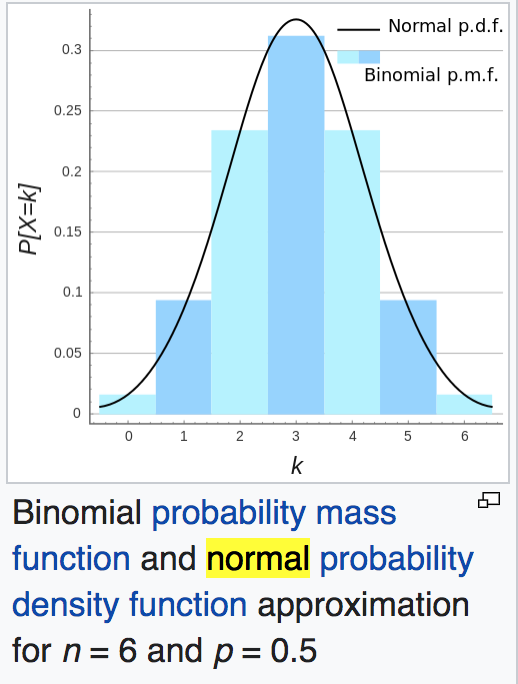

# tips
collection of useful or useless tech tips


## 使用正太分布近似计算组合数

因为二项式分布可以近似为正太分布, 所以组合数C(n,m)可以用正态的函数直接来近似, 有时临时预估算个工程的量级啥的,
还挺方便的🤔;
没用的知识get √




```python
import math

def facto(n):
    if n == 1:
        return 1
    return n*facto(n-1)

def combi(n, m):
    return facto(n) / facto(m) / facto(n-m)

def approx_combi(n, m):
    u = n * .5
    sig = (n*.5*.5) ** 0.5

    power = - (m-u) ** 2 / 2 / sig / sig
    return 1.0 / (sig * ((2*math.pi)**.5)) * (math.e ** power) * (2**n)

print("Approximate combination number by normal distribution:")
print("accurate, approximated:")
print(combi(10, 3), '%.3f' % approx_combi(10, 3))
```

Output:

```
Approximate combination number by normal distribution:

accurate, approximated:
120.0     116.093
```
