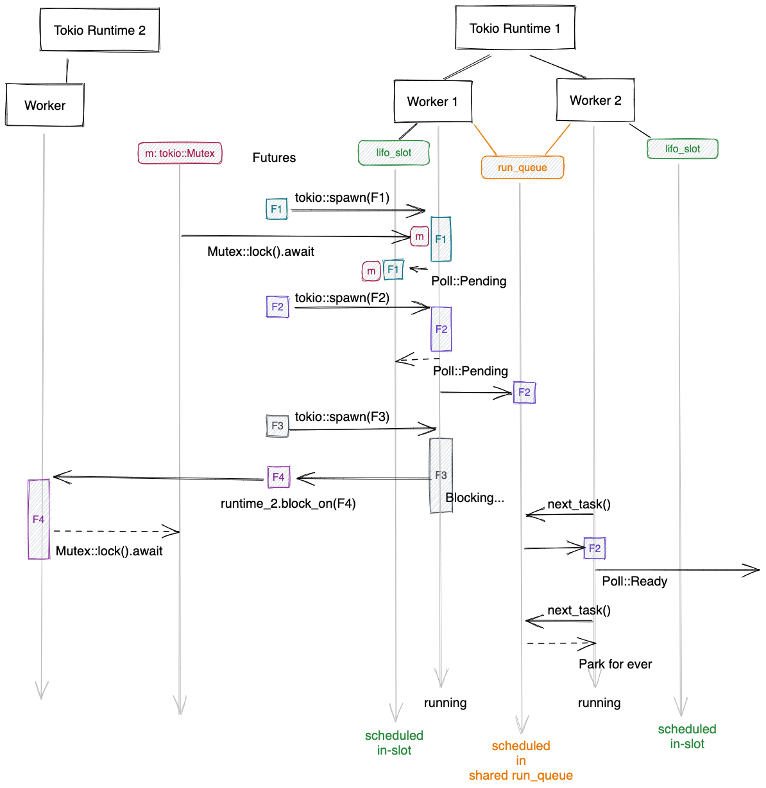

tags:: tips, rust-programming, tokio, blocking, schedule

[Tokio](https://github.com/tokio-rs/tokio) 的 task(一个Future) 里如果使用了阻塞调用, 例如 `std::sync::Mutex`,
会阻塞当前的 tokio-worker 线程, 这个 worker 无法再执行其他 task.
所以代码里如果不可避免的有(少量的)阻塞调用, 就要为 runtime 启动更多的 worker 线程,
保证存在没被阻塞的 worker 来执行待调度的 task, 以避免整个tokio runtime 完全 hang 住(有 task 但没 worker 运行它).

但现实是, 就算 worker 再多, tokio 也可能造成永久性的阻塞.

原因是 tokio 里的待执行 task 不是简单的放到一个queue里,
除了 runtime 内共享的, 可被每个 worker 消费的 [`run_queue`](https://github.com/tokio-rs/tokio/blob/5b947ca2c78ac96f61ef4d4d17d9a1fc16e446c6/tokio/src/runtime/thread_pool/worker.rs#L101), 每个 worker 还有一个自己的 [`lifo_slot`](https://github.com/tokio-rs/tokio/blob/5b947ca2c78ac96f61ef4d4d17d9a1fc16e446c6/tokio/src/runtime/thread_pool/worker.rs#L98),
只存储一个最后被放入的 task (目的是减小调度延迟). `lifo_slot` 只由它所属的 worker 使用, 里面存储的 task 不能被其他 worker 执行.
由于这个结构, 构造 hang 住的方法是如图所示:

- Future f1 被 runtime-1 执行, 持有一个 async 的锁 `m` 后, 返回了 `Pending`,
    这时它被调度到 worker-1 本地的 `lifo_slot`.

- Future f2 在 runtime-1 执行后返回 `Pending`, 被放入共享队列 `run_queue`.

- Future f3 在 runtime-1 中执行, 它将一个任务 `f4` 交给其他的 runtime 去完成(例如为了隔离网络IO和本地磁盘IO),
  使用 [`block_on(f4)`](https://docs.rs/tokio/latest/tokio/runtime/struct.Runtime.html#method.block_on)
  的方式,  等待执行结果返回.

- f4 中也需要锁 `m`, 等待.

这时, f2 在共享队列 `run_queue` 中, 可以被执行, 但是 f1 在 worker-1 本地的 `lifo_slot` 里,
只能由 worker-1 调度, 但 worker-1 当前阻塞在 f3.
于是等待关系形成了一个环: `f4 → m(f1) → f3 → f4`, hang死任务达成.

