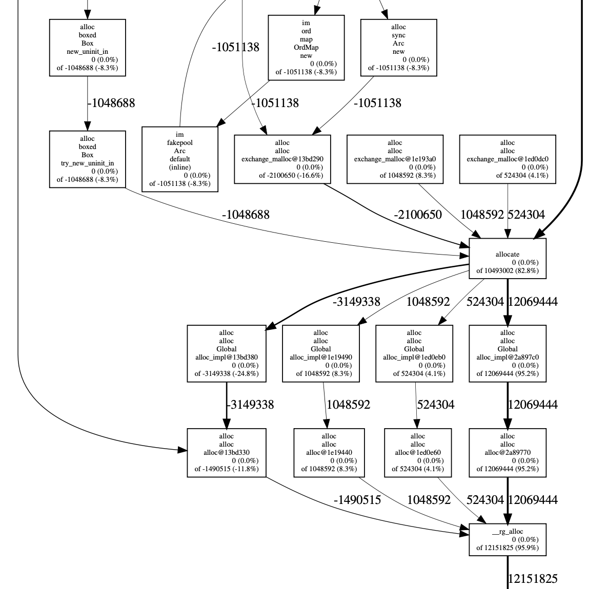
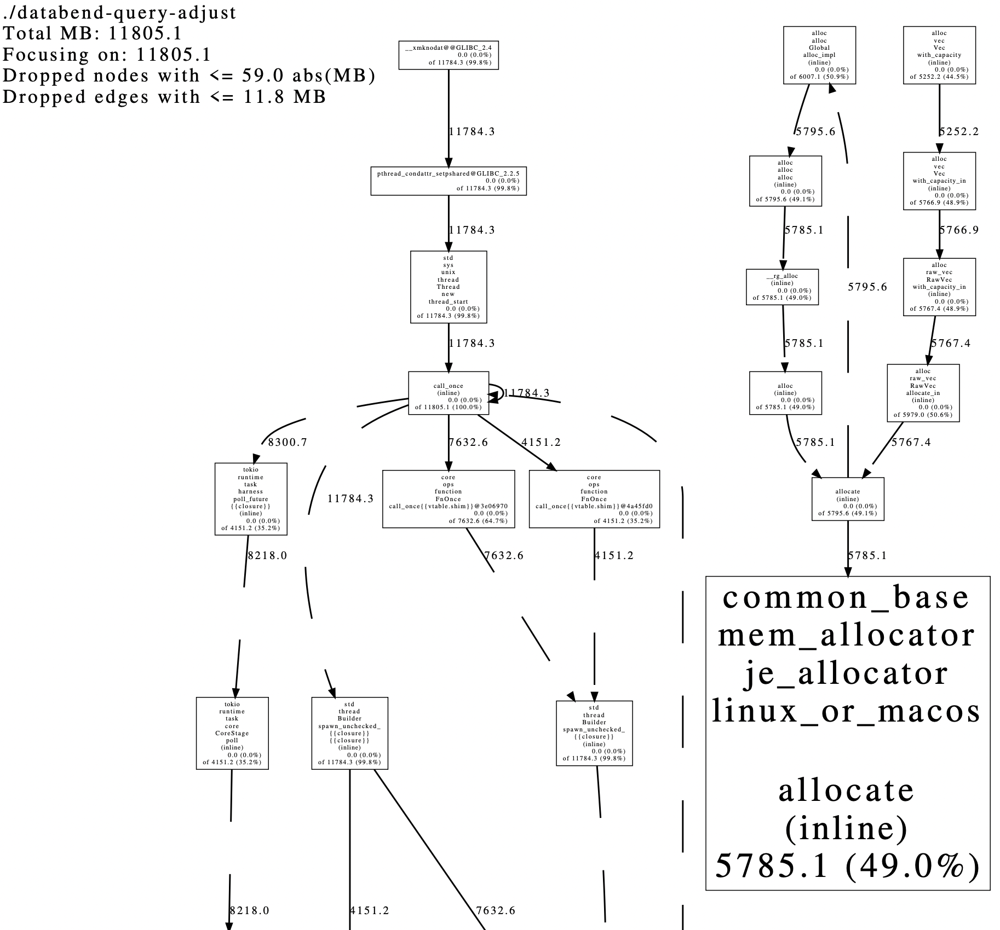

https://docs.databend.com/guides/community/contributor/how-to-profiling#memory-profiling


# How to Profile Databend

## go pprof tool[](https://databend.rs/doc/faq/how-to-profiling#go-pprof-tool)

```
go tool pprof http://localhost:8080/debug/pprof/profile?seconds=20
Fetching profile over HTTP from http://localhost:8080/debug/pprof/profile?seconds=20
Saved profile in /home/bohu/pprof/pprof.cpu.007.pb.gz
Type: cpu
Entering interactive mode (type "help" for commands, "o" for options)
(pprof) top
Showing nodes accounting for 5011, 100% of 5011 total
Dropped 248 nodes (cum <= 25)
Showing top 10 nodes out of 204
      flat  flat%   sum%        cum   cum%
      5011   100%   100%       5011   100%  backtrace::backtrace::libunwind::trace
         0     0%   100%        162  3.23%  <&alloc::vec::Vec<T,A> as core::iter::traits::collect::IntoIterator>::into_iter
         0     0%   100%         45   0.9%  <&mut I as core::iter::traits::iterator::Iterator>::next
         0     0%   100%         77  1.54%  <[A] as core::slice::cmp::SlicePartialEq<B>>::equal
         0     0%   100%         35   0.7%  <[u8; 8] as ahash::convert::Convert<u64>>::convert
         0     0%   100%        199  3.97%  <[u8] as ahash::convert::ReadFromSlice>::read_last_u64
         0     0%   100%         73  1.46%  <[u8] as ahash::convert::ReadFromSlice>::read_last_u64::as_array
         0     0%   100%        220  4.39%  <[u8] as ahash::convert::ReadFromSlice>::read_u64
         0     0%   100%        701 13.99%  <ahash::fallback_hash::AHasher as core::hash::Hasher>::write
         0     0%   100%         26  0.52%  <ahash::random_state::RandomState as core::hash::BuildHasher>::build_hash
```


Or

```shell
go tool pprof -http=0.0.0.0:8081 $HOME/pprof/pprof.cpu.007.pb.gz
```


## Memory profiling[](https://databend.rs/doc/faq/how-to-profiling#memory-profiling)

`databend-query` and `databend-meta` can be built optionally with `jemalloc`, which provides various memory profiling features.

Currently, it does not work on Mac, with either intel or ARM.

### Bring up with memory profiling enabled[](https://databend.rs/doc/faq/how-to-profiling#bring-up-with-memory-profiling-enabled)

- Build `databend-query` and `databend-meta` with memory-profiling feature enabled

  Under the project root path , e.g. `~/workspace/fuse-query/`: `cargo build --features memory-profiling`

- Fire up `databend`, using environment variable `MALLOC_CONF` to enable memory profiling.

  For example: `MALLOC_CONF=prof:true ./target/debug/databend-query`

### Examine memory usage[](https://databend.rs/doc/faq/how-to-profiling#examine-memory-usage)

There are several typical use case to examine memory usage:

#### Dump a heap snapshot from a running `databend-query` or `databend-meta` process.[](https://databend.rs/doc/faq/how-to-profiling#dump-a-heap-snapshot-from-a-running-databend-query-or-databend-meta-process)

NOTE: currently, periodical heap prof dump is NOT supported. A "snapshot" of the heap prof is dump instead.

- Using `jeprof`

  ```shell
  jeprof ./target/debug/databend-query http://localhost:8080/debug/mem
  ```

  

  The TCP port `8080` is defined in the config entry `admin_api_address`. This command loads profiling data from a running server then enters `jeprof` interactive tool, e.g.:

  ```text
      Using local file ./target/debug/databend-query.
      Gathering CPU profile from http://localhost:8080/debug/mem/pprof/profile?seconds=30 for 30 seconds to ~/jeprof/databend-query.1650949265.localhost
      Be patient...
      Wrote profile to /home/zhaobr/jeprof/databend-query.1650949265.localhost
      Welcome to jeprof!  For help, type 'help'.
  ```

  

  Use `top` to list functions ordered by memory allocated.

  ```text
      (jeprof) top
      Total: 16.2 MB
          10.2  62.7%  62.7%     10.2  62.7% ::alloc
           6.0  37.3% 100.0%      6.0  37.3% ::alloc_zeroed
           0.0   0.0% 100.0%     10.2  62.7% ::allocate
           0.0   0.0% 100.0%      0.5   3.3% ::call
           0.0   0.0% 100.0%      4.0  24.7% ::default
           0.0   0.0% 100.0%      1.2   7.2% ::deref
           0.0   0.0% 100.0%      1.2   7.2% ::deref::__stability (inline)
           0.0   0.0% 100.0%      1.2   7.2% ::deref::__static_ref_initialize (inline)
           0.0   0.0% 100.0%      0.5   3.1% ::from
           0.0   0.0% 100.0%      9.2  56.6% ::from_iter
      (jeprof)
  ```

  

  Other `jeprof` commands can be found with `help`.

- Download raw profile data: `curl 'http://localhost:8080/debug/mem/pprof/profile?seconds=0' > mem.prof`. Then one could analyze the profiling data with other tool.

#### Generate memory allocation call graph .[](https://databend.rs/doc/faq/how-to-profiling#generate-memory-allocation-call-graph)

The most common use case is to find memory leak . This can be done by comparing two memory profile before and after an interval:

```shell
curl 'http://localhost:8080/debug/mem/pprof/profile?seconds=0' > a.prof
sleep 10
curl 'http://localhost:8080/debug/mem/pprof/profile?seconds=0' > b.prof
```


Generate a call graph in `pdf` illustrating memory allocation during this interval:

```shell
jeprof \
    --show_bytes \
    --nodecount=1024 \
    --nodefraction=0.001 \
    --edgefraction=0.001 \
    --maxdegree=64 \
    --pdf \
    ./target/debug/databend-meta \
    --base=a.prof \
    b.prof \
    > mem.pdf
```


The output `pdf` would be:




# Simplified:

Fire up `databend`, using environment variable `MALLOC_CONF` to enable memory profiling:
Dump every 2^30 bytes:

```text
MALLOC_CONF=prof:true,lg_prof_interval:30 ./target/release/databend-query
```


### Generate heap profile[](https://databend.rs/doc/faq/how-to-profiling#generate-heap-profile)

Generate a call graph in `pdf` illustrating memory allocation during this interval:

```text
jeprof --pdf ./target/release/databend-query heap.prof > heap.pdf
```




### Fast jeprof[](https://databend.rs/doc/faq/how-to-profiling#fast-jeprof)

jeprof is very slow for large heap analysis, the bottleneck is `addr2line`, if you want to speed up from **30 minutes to 3s**, please use :

```text
git clone https://github.com/gimli-rs/addr2line
cd addr2line
cargo build --features bin
cp ./target/release/addr2line <your-addr2line-find-with-whereis-addr2line>
```
