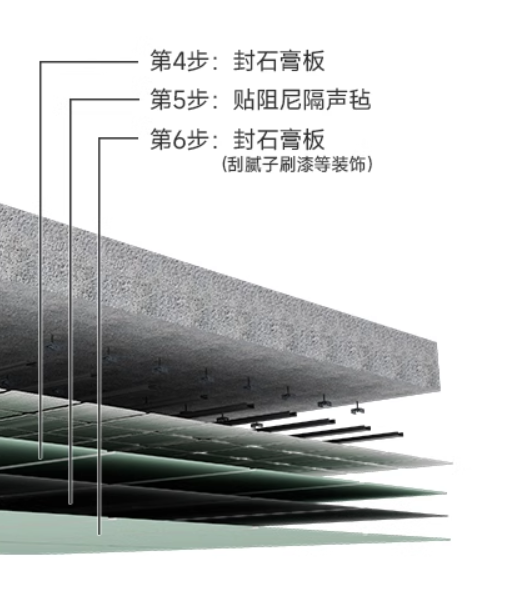
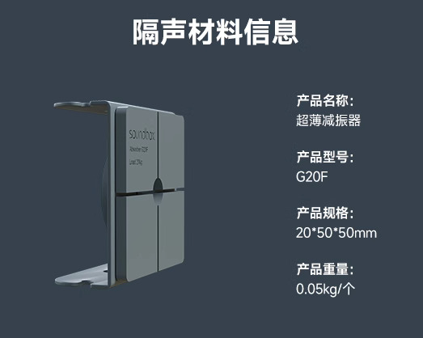
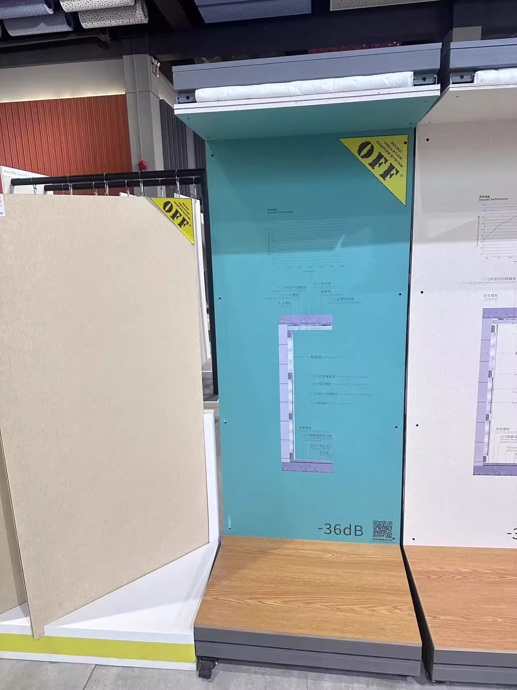
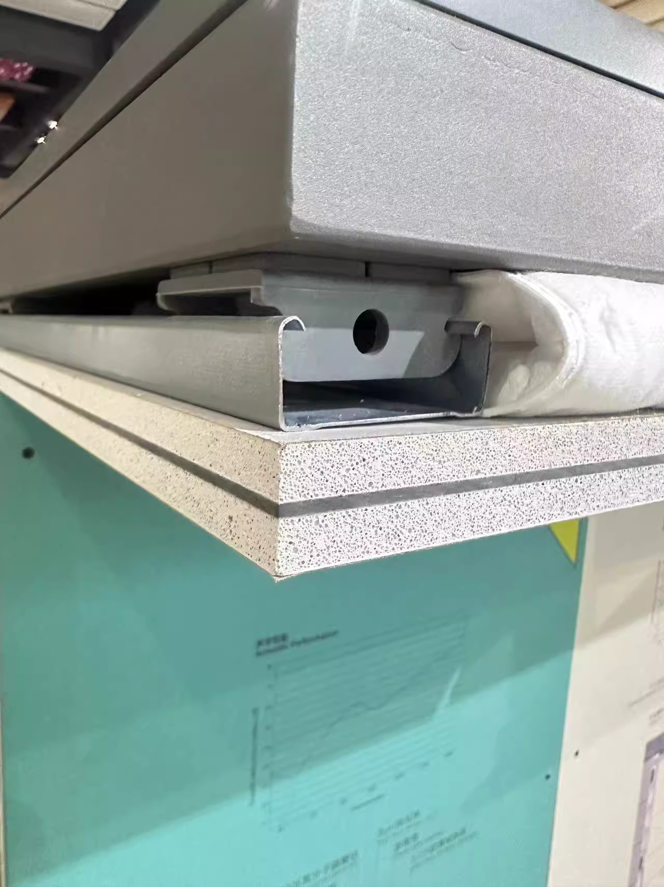
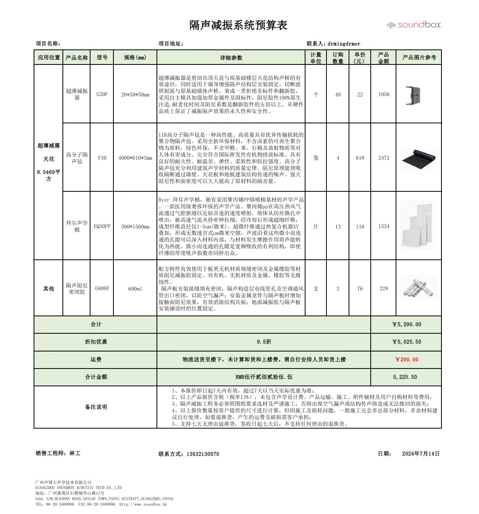

- 品牌: soundbox声博士
- 套餐商品链接:
  https://detail.tmall.com/item.htm?id=657177228009&spm=2015.23436601.0.0
	- 套餐: 声博士超博减震, 其中部分材料自选.
- 整体: 减震器 接 龙骨 接 隔音板, 内填装隔音棉. 其他材料包括螺丝, 密封胶 等.
- 
- 
  
   
  
   
- 隔音棉:
	- 选择: 拜耳声学棉:
	  https://detail.tmall.com/item.htm?spm=a1z10.3-b-s.w4011-15725740278.47.31091560HIMc7e&id=581854963623&rn=f7fb13cd99e7fd6dbe4410bb3b65bcf3&abbucket=9
- 隔音板:
	- 选择: 石膏板+高分子阻尼隔音毡(3mm)+石膏板:
		- 本地买石膏板, 淘宝卖隔音毡:
		- 石膏板12mm: 7kg/m^2 ~ 10kg/m^2
	- 未选(因为运输太重了...): G15E  1220*1220*12mm 一张1.48平方米，重量是27.5kg  18kg/m^2 仅有淘宝有 https://detail.tmall.com/item.htm?id=541388282947&spm=2015.23436601.0.0
		- > 我们的图片是隔音毡的结构，这个比较轻一些，一般家庭容易接受一些; 石膏板+隔音毡+石膏板夹层结构是隔音板的替代结构
- 隔音毡:
	- 选择: 高分子阻尼隔音毡 3MM
	  https://detail.tmall.com/item.htm?id=534664384678&spm=2015.23436601.0.0
	- 未选: G10:
	  https://detail.tmall.com/item.htm?id=540407471911&spm=2015.23436601.0.0
- 运输:
  周一到周五，16点前付款当天发的
  北京大概3-5天的了
- 安装:
  下安装单并且到货通知后的3至5天，最晚不会超过7个工作日能上门安装，师傅会提前一两天联系预约时间的。咱们隔音只做到石膏板这一层，不含刮腻子和刷油漆的哈，并且完后的垃圾需要您自行处理的，如需清运垃圾请提前沟通协商费用。如果天花或墙体是空心的（预制板或夹板）请一定要提前告知我们。
	- 可以介绍安装师傅，安装费用大概是260元左右一平方（以跟安装师傅协商的费用为准）一般镇以上的都可以安排。
	  安装费用含辅材：轻钢龙骨、膨胀螺丝和石膏板。
	  10平方起做，不足10平方按10平方收费哦。
	  安装不是捆绑的哈，也可以当地找师傅，我们提供指导呢
- ---
- 房间大小:
  363cm*263cm
- 施工时间: 2-3天
- 产品费+运费+上楼+安装方收的费用
	-
	-
- 价格:
  隔音毡: 253/m^2
  声学棉: 184/m^2
- 当前费用:
  5225 淘宝买材料
  50 搬上楼费用
  1200 微信转 安装费1
  1400 淘宝拍 安装费2
   
-
- 其他资源:
	- 声博士官网:
		- 碳塑隔声板
		  https://www.soundbox.hk/sound-insulation-damping-system/sound-insulation-board/
		- 高分子隔声毡
		  https://www.soundbox.hk/sound-insulation-damping-system/high-polymer-sound-insulation-felt/
		- 超薄减振器
		  https://www.soundbox.hk/sound-insulation-damping-system/vibration-absorber/
		-