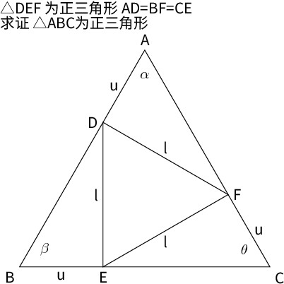

tags:: tips, math, mid-scheel, geometry

△DEF 为正三角形 AD=BF=CE
求证 △ABC为正三角形.md

假设 $\angle \alpha < \angle \theta$

$$
\begin{align}

\cos \alpha & = \frac{u^2 + |AF|^2 - l^2}{2 u |AF|}
            = \frac{u^2 + x^2 - l^2}{2 u x} \\

(\cos \alpha)' &= (\frac{(u^2 - l^2)}{2u} \frac{1}{x} + \frac{x}{2u})'
               = \frac{(l^2 - u^2)}{2u} \frac{1}{x^2} + \frac{1}{2u}

\end{align}

$$

如果 $l > u$, 随着 $\alpha$ 增大 $|AF|$ 减小

$$

\begin{align}
& \angle \alpha < \angle \theta \\
&=> |AF| < |CE| \\
&=> |AC| < |BC| \\
&=> \angle \beta < \angle \alpha \\
&=> |BD| > |AF| \\
&=> |AB| > |AC| \\
&=> \angle \theta > \angle \beta \\
&=> |CE| < |BD| \\
&=> |BC| < |AB| \\
&=> \angle \alpha > \angle \theta \\
\end{align}
$$
