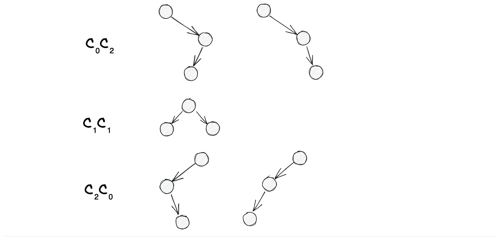

tags:: math, math-combinatorics, catalan-number, binary-tree

假设有n个节点 binary-tree 共有 $C_n$ 种,
对于所有左右子树分别是i个节点和n-i个节点的 binary-tree, 共有 $C_{i} \times C_{n-i}$ 种.

于是得到递推式: $C_{n+1} = C_0 C_{n} + C_1 C_{n-1} + ... + C_n C_0$

符合这个递推式的一定是一个 [Catalan-number](./Catalan-number.md), 👈 文中给出了 Catalan 的通项公式为:

$$
C_n = \frac{1}{n+1} {2n \choose n}
$$

**例如**, 3节点的 binary-tree 有 $6!/3!/3!/(3+1)$ 共5种:

<!-- 列出它们, `*` 表示tree的节点, `x` 表示null节点: -->

<!--
   - - $C_0 C_2$: `x*((x*x)*x)` `x*(x*(x*x))`
   - - $C_1 C_1$: `(x*x)*(x*x)`
   - - $C_2 C_0$: `((x*x)*x)*x` `(x*(x*x))*x`
   -->

