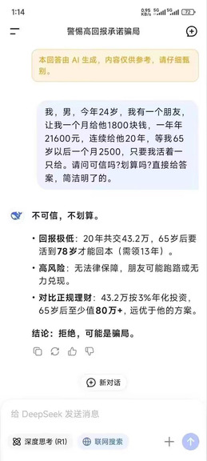

> **Q:** **我，男，今年24岁，我有一个朋友，让我一个月给他1800块钱，一年21600元，连续给他20年，等我65岁以后一个月2500，只要我活着一只给。请问可信吗？划算吗？**

**AI 回答**:

```
不可信，不划算。
•回报极低：20年共交43.2万，65岁后要活到78岁才能回本（需领13年）。
•高风险：无法律保障，朋友可能跑路或无力兑现。
•对比正规理财：43.2万按3%年化投资，
65岁后至少值80万+，远优于他的方案。
结论：拒绝，可能是骗局
```



## 📊 投资收益对比分析

完整表格: [每月存1800,65岁后有夺钱.xlsx](每月存1800,65岁后有夺钱.xlsx)

### 计算参数
- **每年上交**: 1800 × 12 = 21,600元
- **假设收益率**: 3%

### 📈 20年投资收益详表

| 年纪 | 年结余 | 年收益(去年结余 × 收益率) |
|------|-------:|-------------------------:|
| 24   | 21,600 |                          |
| 25   | 43,848 | 648                      |
| 26   | 66,763 | 1,315                    |
| 27   | 90,366 | 2,003                    |
| 28   | 114,677| 2,711                    |
| 29   | 139,718| 3,440                    |
| ..   | ... | ...                      |
| ..   | 福报ing... | ...                      |
| ..   | ... | ...                      |
| 62   | 1,560,259| 44,815                 |
| 63   | 1,628,667| 46,808                 |
| 64   | 1,699,127| 48,860                 |
| **65** | **1,771,701** | **50,974** |
| 66   | 1,846,452| 53,151                 |

### 💰 收益对比

**65岁时资产对比：**
- 朋友方案：累计投入43.2万，开始每月领2500元
- 正规投资：约177万资产，远超朋友方案

**结论：正规投资收益是朋友方案的4倍以上！**
