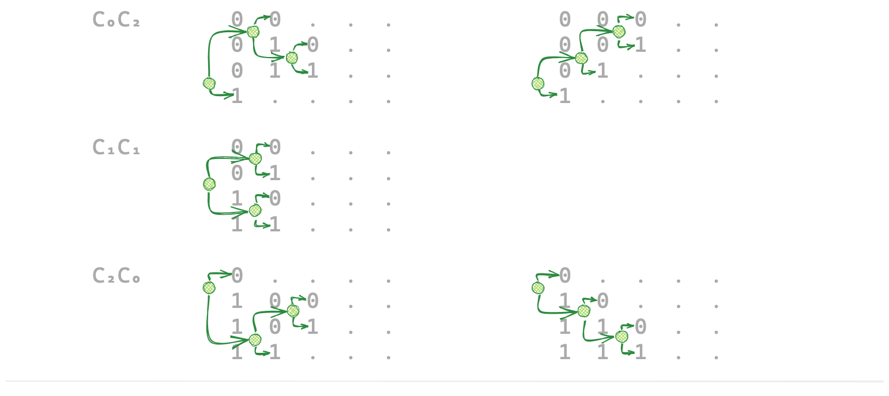

tags:: tips, binary-tree, catalan-number, filter, succinct

为一组排序的字符串创建一个 range filter, 能检查输入key是否**可能存在**, 如果存在, 给出其在排序字符串集合中的什么位置; 尽可能小.

将 n 个排序字符串的 filter 要存储的信息分成3部分: **确定排序关系的关键bit**, **前缀部分**和**后缀部分**:

**第1部分: 存储决定先后顺序的关键 bits**:
假设有 4 个排好序的 bit 字符串,
只考虑决定他们之间先后顺序的 **关键bit**,
即去掉公共前缀如 `A...`, `B...`, `C...` 和 后缀 `...` 之后, 下图中剩下的 0和1, 就是 **关键bit**:

```
A...  0  B...  0  ...             --->    00..
A...  0  B...  1  C...  0  ...    --->    010.
A...  0  B...  1  C...  1  ...    --->    011.
A...  1  ...                      --->    1...
```

其中每次相邻2行上 0/1 的变化, 都将一组字符串拆分成上下两部分.
这几个 0/1 的变化, 直接映射到一个 3 节点 bianry-tree.
即, **n 个排序串的一种关键bit的排列方式对应一个 n-1 节点的 binary-tree**.
下面列出了4个排序串所有可能的 **关键bit** 排列方式, 以及对应的 binary-tree:



因为 [存储 n 个节点的 binary-tree 只需 2n 个bit](./存储%20n%20节点的%20binary-tree%20最少只需%202n%20bit.md).
所以存储这些 **关键bit** 的空间开销是 `2(n-1)` bit.

**第2部分: 存储前缀**, 如`A...`, `B...`等,
因为每个 binary-tree 的节点对应一个前缀,
我们将其存储到一个变长字符串的数组中.
假设前缀平均长度为 k 个 bit, 前缀部分存储占 `k*n` bit.

**第3部分: 存储后缀**, 即那些与字符串排序完全无关的部分 `...`,
可以选择存储全量的后缀, 部分后缀或完全不存储后缀, 取决于对查询的 false
positive rate 的要求.
